# AI Travel Concierge Agent

[](https://www.python.org/downloads/)
[](https://azure.microsoft.com/en-us/products/ai-services/openai-service)
[](https://github.com/microsoft/semantic-kernel)
[](https://azure.microsoft.com/en-us/products/cosmos-db)
[](https://opensource.org/licenses/MIT)

An intelligent, production-ready AI agent that provides comprehensive travel planning assistance using **Microsoft Semantic Kernel**, **Azure OpenAI**, and **Azure Cosmos DB**. The agent orchestrates 7 specialized tools to deliver personalized travel recommendations including weather forecasts, currency conversion, restaurant discovery, credit card optimization, calendar scheduling, and multi-language translation.

---

## Table of Contents

- [Project Highlights](#project-highlights)
- [Demo Output](#demo-output)
- [Architecture](#architecture)
- [Technology Stack](#technology-stack)
- [Key Features](#key-features)
- [Project Structure](#project-structure)
- [Installation](#installation)
- [Usage](#usage)
- [Testing](#testing)
- [Technical Deep Dive](#technical-deep-dive)
- [What This Project Demonstrates](#what-this-project-demonstrates)
- [Future Enhancements](#future-enhancements)
- [Author](#author)

---

## Project Highlights

| Aspect | Details |
|--------|---------|
| **AI Framework** | Microsoft Semantic Kernel with Azure OpenAI (GPT-4) |
| **Architecture** | Multi-agent tool orchestration with state machine |
| **Memory Systems** | Dual-layer: Short-term (session) + Long-term (Cosmos DB) |
| **RAG Pipeline** | Vector search with Azure Cosmos DB for knowledge retrieval |
| **Tools Integrated** | 7 specialized tools with real API integrations |
| **Evaluation** | LLM-as-Judge evaluation system with correction generation |
| **Test Coverage** | Comprehensive unit and integration tests |

---

## Demo Output

```bash
$ python -m app.main
```

```json
{
  "destination": "Paris",
  "travel_dates": "2026-06-01 to 2026-06-08",
  "weather": {
    "temperature_c": 22.5,
    "conditions": "Partly cloudy",
    "recommendation": "Great weather for sightseeing!"
  },
  "results": [
    {
      "title": "Le Clarence",
      "snippet": "Two-Michelin-starred haute cuisine in a luxurious mansion...",
      "url": "https://www.timeout.com/paris/en/restaurants/best-restaurants-in-paris",
      "category": "restaurant"
    }
  ],
  "card_recommendation": {
    "card": "Chase Sapphire Reserve",
    "benefit": "3x points on travel and dining",
    "fx_fee": "No FX fees",
    "source": "CardTools - Rules-based recommendation"
  },
  "currency_info": {
    "usd_to_eur": 0.8516,
    "sample_meal_usd": 100.0,
    "sample_meal_eur": 85.16,
    "points_earned": 300
  },
  "citations": [
    "https://www.timeout.com/paris/en/restaurants/best-restaurants-in-paris",
    "https://open-meteo.com - Weather data",
    "https://www.frankfurter.app - Currency rates"
  ],
  "next_steps": [
    "Book your flights to Paris",
    "Reserve accommodations in Paris",
    "Research local attractions and create an itinerary",
    "Notify your credit card company of travel plans"
  ]
}
```

---

## Architecture

### High-Level System Architecture

```mermaid
flowchart TB
    subgraph UserLayer["👤 User Interface"]
        UI[/"Natural Language Input"/]
        Output[/"JSON Travel Plan"/]
    end

    subgraph AgentCore["🤖 AI Travel Concierge Agent"]
        SK["Semantic Kernel<br/>Orchestrator"]
        SM["State Machine<br/>Controller"]

        subgraph Tools["🔧 Tool Plugins"]
            direction LR
            WT["☀️ Weather<br/>Open-Meteo"]
            FX["💱 FX<br/>Frankfurter"]
            SR["🔍 Search<br/>Azure AI + Bing"]
            CD["💳 Card<br/>Rules Engine"]
            KB["📚 Knowledge<br/>RAG Vector"]
            CL["📅 Calendar<br/>Scheduler"]
            TR["🌐 Translation<br/>Azure"]
        end

        subgraph Memory["🧠 Memory Systems"]
            STM["Short-Term Memory<br/>Session Context"]
            LTM["Long-Term Memory<br/>Cosmos DB"]
        end

        subgraph Eval["📊 Evaluation"]
            Judge["LLM-as-Judge<br/>Quality Scoring"]
        end
    end

    subgraph Azure["☁️ Azure Services"]
        AOI["Azure OpenAI<br/>GPT-4 + Embeddings"]
        CDB["Azure Cosmos DB<br/>Vector Database"]
        AIF["Azure AI Foundry<br/>Bing Grounding"]
    end

    subgraph External["🌐 External APIs"]
        OM["Open-Meteo API"]
        FF["Frankfurter API"]
    end

    UI --> SK
    SK <--> SM
    SK --> Tools
    SK <--> Memory
    SK --> Eval

    WT <--> OM
    FX <--> FF
    SR <--> AIF
    KB <--> CDB
    TR <--> AOI

    STM <--> AOI
    LTM <--> CDB
    Judge <--> AOI

    SK --> Output

    style AgentCore fill:#e8f4f8,stroke:#0078d4,stroke-width:2px
    style Azure fill:#fff4e6,stroke:#ff8c00,stroke-width:2px
    style Tools fill:#f0f9ff,stroke:#0ea5e9,stroke-width:1px
    style Memory fill:#fdf4ff,stroke:#a855f7,stroke-width:1px
```



### Agent State Machine

The agent follows a robust execution workflow with error handling and recovery states:


### Data Flow Diagram

```mermaid
flowchart LR
    subgraph Input
        A["🗣️ User Query<br/>'Plan a trip to Paris...'"]
    end

    subgraph Processing["Agent Processing Pipeline"]
        B["📝 Extract<br/>Requirements"]
        C["🔧 Execute<br/>Tools"]
        D["🔀 Aggregate<br/>Results"]
        E["✨ Synthesize<br/>Response"]
    end

    subgraph ToolCalls["Parallel Tool Execution"]
        T1["☀️ Weather API"]
        T2["💱 FX API"]
        T3["🔍 Bing Search"]
        T4["💳 Card Rules"]
    end

    subgraph Output
        F["📋 TripPlan JSON"]
    end

    A --> B
    B --> C
    C --> T1 & T2 & T3 & T4
    T1 & T2 & T3 & T4 --> D
    D --> E
    E --> F

    style Processing fill:#dbeafe,stroke:#3b82f6
    style ToolCalls fill:#dcfce7,stroke:#22c55e
```



### Tool Orchestration


### Memory Architecture


---

## Technology Stack

### Core Technologies

| Technology | Purpose | Why This Choice |
|------------|---------|-----------------|
| **Python 3.11+** | Primary language | Modern async support, type hints |
| **Microsoft Semantic Kernel** | AI orchestration | Enterprise-grade tool orchestration, native Azure integration |
| **Azure OpenAI (GPT-4)** | LLM backbone | Production reliability, enterprise security |
| **Azure Cosmos DB** | Vector database | Scalable NoSQL with vector search, global distribution |
| **Pydantic** | Data validation | Type-safe models, JSON serialization |

### Azure Services

- **Azure OpenAI Service** - GPT-4 for chat, text-embedding-3-small for embeddings
- **Azure Cosmos DB** - Vector storage for RAG and long-term memory
- **Azure AI Foundry** - Bing grounding for web search
- **Azure Translator** - Multi-language translation support

### External APIs

- **Open-Meteo** - Weather forecasts (free, no key required)
- **Frankfurter** - Real-time currency exchange rates (free)
- **Bing Search** - Web search via Azure AI Foundry Agent

---

## Key Features

### 1. Intelligent Tool Orchestration

Seven specialized tools that work together to provide comprehensive travel assistance:

| Tool | Function | API/Source |
|------|----------|------------|
| **WeatherTools** | 7-day weather forecasts | Open-Meteo API |
| **FxTools** | Real-time currency conversion | Frankfurter API |
| **SearchTools** | Restaurant & attraction discovery | Azure AI + Bing |
| **CardTools** | Credit card optimization | Rules-based engine |
| **KnowledgeTools** | RAG-based knowledge retrieval | Cosmos DB vectors |
| **CalendarTools** | Availability checking & scheduling | Built-in scheduler |
| **TranslationTools** | Multi-language phrasebook | Azure Translator |

### 2. Dual-Layer Memory System

**Short-Term Memory** (`app/memory.py`)
- Session-based conversation context
- Sliding window eviction (by items and tokens)
- Tool call tracking and search

**Long-Term Memory** (`app/rag/long_term_memory/`)
- Persistent cross-session memory in Cosmos DB
- Importance-based pruning strategies
- AI-optimized memory reordering
- Access frequency tracking

### 3. RAG Pipeline with Vector Search

- Semantic search using Azure OpenAI embeddings
- Cosmos DB vector indexing for fast retrieval
- Knowledge base with credit card benefits data
- Cosine similarity scoring for relevance ranking

### 4. LLM-as-Judge Evaluation System

Comprehensive evaluation with 6 criteria:
- **Accuracy** (25%) - Correctness of information
- **Completeness** (20%) - Coverage of user needs
- **Relevance** (20%) - Appropriateness to query
- **Tool Usage** (15%) - Effective tool orchestration
- **Structure** (10%) - Response organization
- **Citations** (10%) - Source attribution

**Enhanced Features:**
- Automatic correction generation for low-scoring responses
- Tool usage suggestions and optimization
- Debugging insights for workflow issues

### 5. Structured Output with Pydantic Models

Type-safe data models ensuring consistent, validated responses:

```python
class TripPlan(BaseModel):
    destination: str
    travel_dates: str
    weather: Optional[Weather]
    results: Optional[List[SearchResult]]
    card_recommendation: CardRecommendation
    currency_info: CurrencyInfo
    citations: Optional[List[str]]
    next_steps: List[str]
```

---

## Project Structure

```
AI-Travel-Concierge/
├── app/
│   ├── main.py                 # Entry point - Semantic Kernel orchestration
│   ├── models.py               # Pydantic data models (TripPlan, Weather, etc.)
│   ├── state.py                # Agent state machine (12 phases)
│   ├── memory.py               # Short-term memory system
│   ├── synthesis.py            # Response synthesis and formatting
│   ├── filters.py              # Kernel filters (logging, telemetry, guardrails)
│   │
│   ├── tools/                  # Tool plugins
│   │   ├── weather.py          # Weather forecasts (Open-Meteo)
│   │   ├── fx.py               # Currency conversion (Frankfurter)
│   │   ├── search.py           # Web search (Azure AI + Bing)
│   │   ├── card.py             # Credit card recommendations
│   │   ├── knowledge.py        # RAG knowledge retrieval
│   │   ├── calendar.py         # Calendar scheduling
│   │   └── translation.py      # Multi-language translation
│   │
│   ├── rag/                    # RAG pipeline
│   │   ├── ingest.py           # Data ingestion with embeddings
│   │   ├── retriever.py        # Vector search retrieval
│   │   └── long_term_memory/   # Long-term memory module
│   │       ├── core.py         # LongTermMemory class
│   │       ├── models.py       # MemoryItem dataclass
│   │       ├── db.py           # Cosmos DB connection
│   │       ├── pruning.py      # Memory pruning strategies
│   │       ├── reordering.py   # Memory reordering
│   │       └── optimization.py # AI-optimized performance
│   │
│   ├── eval/                   # Evaluation system
│   │   ├── judge.py            # Simple rule-based evaluation
│   │   └── llm_judge.py        # LLM-as-Judge with corrections
│   │
│   └── utils/                  # Utilities
│       ├── config.py           # Configuration management
│       └── logger.py           # Structured logging
│
├── tests/                      # Test suite
│   ├── test_models.py          # Data model tests
│   ├── test_tools.py           # Tool function tests
│   ├── test_state.py           # State machine tests
│   ├── test_memory.py          # Memory system tests
│   └── test_memory_integration.py  # Integration tests
│
├── scripts/                    # Utility scripts
│   └── ingest_knowledge.py     # Knowledge base ingestion
│
├── requirements.txt            # Python dependencies
├── .env.example                # Environment variables template
└── README.md                   # This file
```

---

## Installation

### Prerequisites

- Python 3.11+
- Azure subscription with:
  - Azure OpenAI Service (GPT-4 and embedding deployments)
  - Azure Cosmos DB account
  - Azure AI Foundry project (for Bing search)

### Setup

1. **Clone the repository**
   ```bash
   git clone https://github.com/yourusername/AI-Travel-Concierge.git
   cd AI-Travel-Concierge
   ```

2. **Create virtual environment**
   ```bash
   python -m venv .venv
   source .venv/bin/activate  # On Windows: .venv\Scripts\activate
   ```

3. **Install dependencies**
   ```bash
   pip install -r requirements.txt
   ```

4. **Configure environment variables**
   ```bash
   cp .env.example .env
   # Edit .env with your Azure credentials
   ```

   Required environment variables:
   ```env
   # Azure OpenAI
   AZURE_OPENAI_ENDPOINT=https://your-resource.openai.azure.com/
   AZURE_OPENAI_KEY=your_key_here
   AZURE_OPENAI_API_VERSION=2025-01-01-preview
   AZURE_OPENAI_CHAT_DEPLOYMENT=gpt-4.1
   AZURE_OPENAI_EMBED_DEPLOYMENT=text-embedding-3-small

   # Azure Cosmos DB
   COSMOS_ENDPOINT=https://your-cosmos.documents.azure.com:443/
   COSMOS_KEY=your_cosmos_key_here
   COSMOS_DB=ragdb
   COSMOS_CONTAINER=snippets

   # Azure AI Foundry (for Bing Search)
   PROJECT_ENDPOINT=https://your-project.services.ai.azure.com/api/projects/proj-default
   AGENT_ID=your_agent_id
   ```

5. **Ingest knowledge base (optional)**
   ```bash
   python -m app.rag.ingest
   ```

---

## Usage

### Run the Agent

```bash
python -m app.main
```

### Programmatic Usage

```python
from app.main import run_request
import json

# Natural language travel planning
result = run_request(
    "I want to go to Paris from 2026-06-01 to 2026-06-08 with my BankGold card"
)
plan = json.loads(result)

print(f"Destination: {plan['destination']}")
print(f"Weather: {plan['weather']['conditions']}")
print(f"Best Card: {plan['card_recommendation']['card']}")
```

### Interactive Chat

```bash
python chat.py
```

---

## Testing

### Run All Tests

```bash
python -m pytest tests/ -v
```

### Run Specific Test Categories

```bash
# Data models
python -m pytest tests/test_models.py -v

# Tool functions
python -m pytest tests/test_tools.py -v

# State machine
python -m pytest tests/test_state.py -v

# Memory systems
python -m pytest tests/test_memory.py -v
```

### Run Evaluation

```bash
python -m app.eval.judge
```

---

## Technical Deep Dive

### State Machine Implementation

The agent uses a sophisticated state machine with 12 phases for robust execution:

```python
class Phase(Enum):
    # Core workflow
    Init = "Init"
    ClarifyRequirements = "ClarifyRequirements"
    PlanTools = "PlanTools"
    ExecuteTools = "ExecuteTools"
    Synthesize = "Synthesize"
    Done = "Done"

    # Error handling
    AWAITING_USER_CLARIFICATION = "AwaitingUserClarification"
    HANDLING_TOOL_ERROR = "HandlingToolError"
    VALIDATING_RESULTS = "ValidatingResults"
    RETRYING_TOOLS = "RetryingTools"
    ESCALATING_ERROR = "EscalatingError"
```

### Memory Pruning Strategies

Long-term memory supports multiple pruning strategies:

1. **Importance-based** - Remove low-importance memories first
2. **Age-based** - Remove oldest memories
3. **Access frequency** - Remove least-accessed memories
4. **Hybrid** - Combination of all strategies with AI scoring

### RAG Implementation


```python
# Vector search with cosine similarity
def retrieve(query: str, k: int = 5) -> List[Dict]:
    # 1. Generate query embedding
    query_embedding = embed_texts([query])[0]

    # 2. Fetch documents from Cosmos DB
    documents = container.query_items(...)

    # 3. Calculate cosine similarity
    for doc in documents:
        similarity = cosine_similarity(query_embedding, doc["embedding"])

    # 4. Return top-k results
    return sorted_results[:k]
```

---

## What This Project Demonstrates

### Software Engineering Skills

- **Clean Architecture** - Separation of concerns, modular design
- **Design Patterns** - State machine, plugin architecture, factory pattern
- **Error Handling** - Graceful degradation, retry logic, fallbacks
- **Type Safety** - Pydantic models, type hints throughout
- **Testing** - Unit tests, integration tests, evaluation harness

### AI/ML Engineering Skills

- **LLM Integration** - Azure OpenAI with Semantic Kernel
- **RAG Pipeline** - Vector embeddings, semantic search
- **Prompt Engineering** - Structured prompts, JSON extraction
- **Agent Design** - Multi-tool orchestration, state management
- **Evaluation** - LLM-as-Judge, automated quality assessment

### Cloud & DevOps Skills

- **Azure Services** - OpenAI, Cosmos DB, AI Foundry
- **Configuration Management** - Environment variables, validation
- **Logging & Monitoring** - Structured logging, telemetry hooks
- **Security** - Credential management, no hardcoded secrets

---

## Future Enhancements

- [ ] **Flight Booking Integration** - Amadeus/Skyscanner API
- [ ] **Hotel Recommendations** - Booking.com/Expedia integration
- [ ] **Interactive Maps** - Google Maps visualization
- [ ] **Voice Interface** - Azure Speech Services
- [ ] **Mobile App** - React Native frontend
- [ ] **Multi-user Support** - User authentication and profiles
- [ ] **Itinerary Generation** - Day-by-day planning with AI

---

## Author

**Saurabh Bhardwaj**

- Building production-ready AI agents with Microsoft Semantic Kernel
- Expertise in Azure AI services and cloud architecture
- Passionate about creating intelligent, user-friendly applications

---

## License

This project is licensed under the MIT License - see the [LICENSE](LICENSE) file for details.

---

## Acknowledgments

- [Microsoft Semantic Kernel](https://github.com/microsoft/semantic-kernel) - AI orchestration framework
- [Azure OpenAI Service](https://azure.microsoft.com/en-us/products/ai-services/openai-service) - LLM backbone
- [Open-Meteo](https://open-meteo.com/) - Free weather API
- [Frankfurter](https://www.frankfurter.app/) - Free currency exchange API
